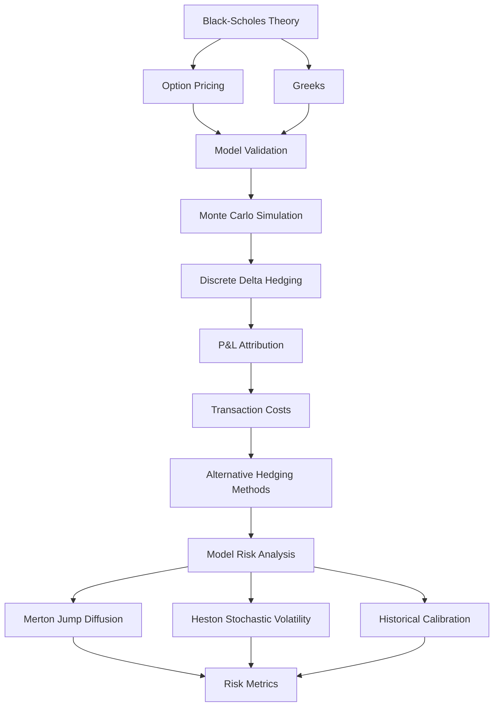

# Delta Hedging Under Model Risk

A research project that evaluates the performance of delta hedging under increasingly realistic market assumptions. The notebook begins with the Black–Scholes framework and extends it with discrete rebalancing, transaction costs, jump diffusion, stochastic volatility, and historical market calibration. The objective is to quantify hedge performance and identify sources of model risk. 
I built this to extend my understanding and intuition of options theory.

## Highlights

- End-to-end implementation of a delta hedging framework.
- Analytical and Monte Carlo approaches for pricing and hedging.
- Black–Scholes, Merton Jump Diffusion, and Heston stochastic volatility models.
- Empirical study of transaction costs and hedging error.
- Historical SPY calibration and statistical risk reporting.

---

# Table of Contents

- [Motivation](#motivation)
- [Features](#features)
- [Architecture](#architecture)
- [Methodology](#methodology)
- [Results](#results)
- [Repository Structure](#repository-structure)
- [Installation](#installation)
- [Usage](#usage)
- [Limitations](#limitations)
- [Future Improvements](#future-improvements)
- [References](#references)

---

# Motivation

The Black–Scholes model assumes continuous hedging, constant volatility, and frictionless markets. Financial markets do not satisfy these assumptions.

This project measures how hedge performance changes when these assumptions are relaxed. Each model extension introduces one source of market realism and isolates its effect on hedging error.

---

# Features

- Black–Scholes option pricing
- Analytical and numerical Greeks
- Monte Carlo simulation of geometric Brownian motion
- Self-financing discrete delta hedging
- Gamma–Theta P&L attribution
- Transaction cost modelling
- Optimal hedge frequency analysis
- Band hedging
- Leland volatility adjustment
- Merton Jump Diffusion
- Heston stochastic volatility
- Historical SPY calibration
- Value at Risk (VaR) and Conditional Value at Risk (CVaR)

---

# Architecture



---

# Methodology

The notebook follows this workflow.

1. Price European options with the Black–Scholes model.
2. Validate analytical Greeks against finite-difference estimates.
3. Simulate underlying price paths using geometric Brownian motion.
4. Delta hedge each path with discrete rebalancing.
5. Measure hedge error and attribute P&L to Gamma and Theta.
6. Introduce proportional transaction costs.
7. Compare standard hedging, band hedging, and Leland's volatility adjustment.
8. Replace Black–Scholes assumptions with jump diffusion and stochastic volatility.
9. Calibrate model inputs using historical SPY data.
10. Compare hedge performance using statistical risk metrics.

---

# Results

The simulations reproduce several expected theoretical results.

- Analytical Greeks agree with finite-difference estimates.
- Put-call parity holds numerically.
- The Gamma–Theta identity is verified.
- Hedge error decreases approximately with \(1/\sqrt{N}\).
- Transaction costs create an optimal hedge frequency.
- Jump risk produces irreducible hedge losses.
- Stochastic volatility increases residual hedging error.
- Expected asset drift has little effect on delta hedge performance.

## Example Outputs

### Black–Scholes Validation

> **Placeholder:** Finite-difference convergence plot.

```
docs/images/fd_validation.png
```

---

### Hedge Error Scaling

> **Placeholder:** Log-log hedge error scaling plot.

```
docs/images/error_scaling.png
```

---

### P&L Distribution

> **Placeholder:** Hedged portfolio P&L distribution.

```
docs/images/pnl_distribution.png
```

---

### Transaction Cost Analysis

> **Placeholder:** Hedge frequency versus total cost.

```
docs/images/transaction_costs.png
```

---

### Jump Diffusion

> **Placeholder:** Comparison with the Black–Scholes model.

```
docs/images/merton_results.png
```

---

### Stochastic Volatility

> **Placeholder:** Heston model results.

```
docs/images/heston_results.png
```

---

### Risk Metrics

> **Placeholder:** VaR and CVaR summary.

```
docs/images/risk_metrics.png
```

---

# Repository Structure

```text
.
├── README.md
├── delta_hedging_model_risk.ipynb
├── OriginalCode.py
```

---

# Installation

Clone the repository.

```bash
git clone https://github.com/<username>/<repository>.git
cd <repository>
```

Create a virtual environment.

```bash
python -m venv .venv
```

Activate the environment.

**Linux / macOS**

```bash
source .venv/bin/activate
```

**Windows**

```bash
.venv\Scripts\activate
```

Install the required packages.

```bash
pip install -r requirements.txt
```

Start Jupyter Notebook.

```bash
jupyter notebook
```

Open

```text
delta_hedging_model_risk.ipynb
```

---

# Usage

Run the notebook from top to bottom.

Typical workflow:

```text
Price option
      │
      ▼
Compute Greeks
      │
      ▼
Generate Monte Carlo paths
      │
      ▼
Run delta hedge
      │
      ▼
Measure hedge error
      │
      ▼
Add market frictions
      │
      ▼
Compare model assumptions
      │
      ▼
Generate risk metrics
```

---

# Limitations

Current limitations include:

- European options only
- Single underlying asset
- Constant interest rates
- Constant proportional transaction costs
- No market impact
- No liquidity constraints
- Notebook-based implementation
- Limited calibration procedure

---

# Future Improvements

Possible extensions include:

- Local volatility models
- Rough volatility models
- American option pricing
- Multi-asset hedging
- GPU-accelerated Monte Carlo
- Automatic calibration pipelines
- Unit tests and continuous integration
- Modular Python package
- Interactive dashboard
- Benchmarking against QuantLib

---

# References

- Black, F., & Scholes, M. (1973). *The Pricing of Options and Corporate Liabilities.*
- Merton, R. C. (1976). *Option Pricing When Underlying Stock Returns Are Discontinuous.*
- Heston, S. L. (1993). *A Closed-Form Solution for Options with Stochastic Volatility.*
- Leland, H. E. (1985). *Option Pricing and Replication with Transaction Costs.*

## Libraries

- NumPy
- SciPy
- pandas
- Matplotlib
- yfinance
